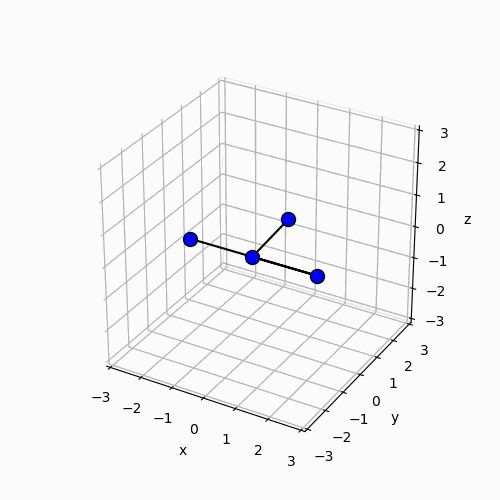

This is a Jupyter notebook to simulate and animate the Dzhanibekov effect of a tumbling T-handle in microgravity. I used SymPy, Python's symbolic mathmatics library, to derive Euler's equations of motion (EoMs) under a torque-free conditon. The EoMs are numerically solved using the odeint package from SciPy. The simulation results will be presented in 3D animation using Matplotlib as shown below.

