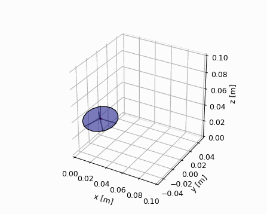

This is to simulate and animate a heavy symmetrical top (Poisson Top) whose bottom end is free to move on a horizontal surface but affected by frictional force. SymPy is used to derive Euler's equations of motion (EoMs) that are numerically solved using the odeint package from SciPy. The simulation result is presented in 3D animation using Matplotlib as below.

