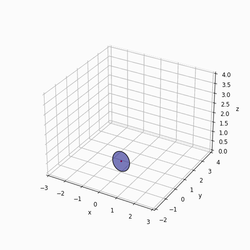

This is a Jupyter notebook to simulate and animate a rolling disk under the no-slipping condition. SymPy is used to derive Euler's equations of motion (EoMs) for the disk. The EoMs are numerically solved using the odeint package from SciPy. The simulation result is presented in 3D animation using Matplotlib asbelo.

